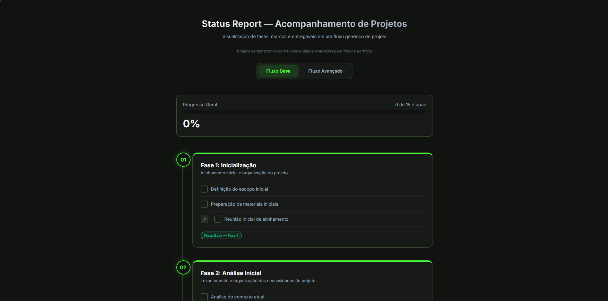
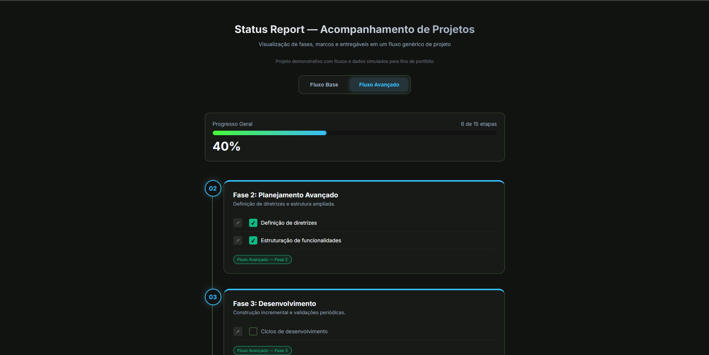
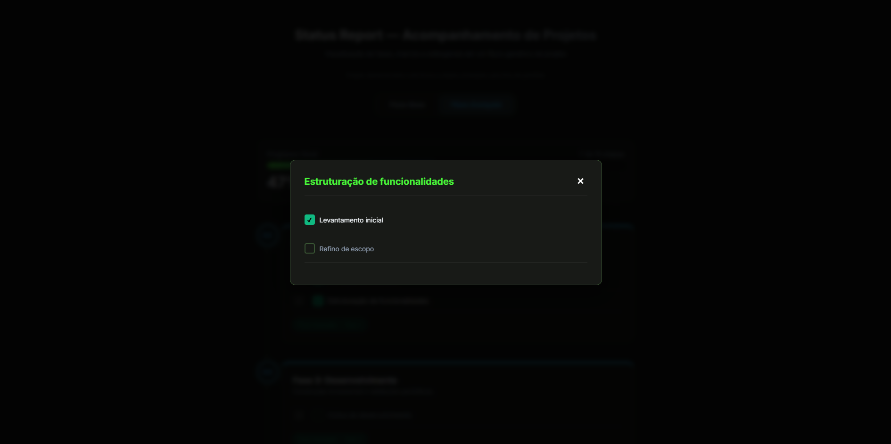

# ✅ Checklist — Acompanhamento de Projetos

Aplicação web interativa para acompanhamento de **fases, marcos e entregáveis de um projeto genérico**, com múltiplos fluxos, visualização em timeline, sistema de modais e progresso salvo automaticamente.

> ⚠️ Este projeto apresenta **fluxos e processos simulados**, organizados exclusivamente para fins educacionais e de demonstração técnica em portfólio.  
> Todos os dados, estruturas e nomes foram **abstraídos e anonimizados**, não representando operações, empresas ou projetos reais.

---

## 🖥️ Preview

### Fluxo base — visão geral

### Fluxo avançado — mudança de estado e progresso

### Modal com sub‑itens (DOM Portal)

---

## ✨ Funcionalidades

- **Dois fluxos de trabalho** — alternância entre **Fluxo Base** e **Fluxo Avançado**, cada um com fases, cores e entregáveis distintos
- **5 fases por fluxo** — estrutura completa do início à finalização do projeto
- **Timeline visual** — fases organizadas em linha do tempo com numeração sequencial e identidade visual por tipo de fluxo
- **Modais com sub-itens** — botão ↗ abre detalhes de cada etapa sem perder o estado dos checkboxes
- **Progresso em tempo real** — barra e percentual atualizados automaticamente conforme os itens são marcados
- **Persistência local** — progresso salvo via `localStorage`, mantido mesmo após recarregar a página
- **DOM Portal** — sub‑listas são movidas fisicamente para o modal e devolvidas ao fechar, preservando o estado sem duplicação de DOM

---

## 🗂️ Estrutura dos Fluxos

### 🔹 Fluxo Base
1. Inicialização  
2. Análise Inicial  
3. Configuração  
4. Capacitação  
5. Finalização  

### 🔹 Fluxo Avançado
1. Inicialização  
2. Planejamento Avançado  
3. Desenvolvimento  
4. Ativação  
5. Acompanhamento  

---

## 🛠️ Tecnologias

https://img.shields.io/badge/HTML5-E34F26?style=flat&logo=html5&logoColor=white  
https://img.shields.io/badge/CSS3-1572B6?style=flat&logo=css3&logoColor=white  
https://img.shields.io/badge/JavaScript-F7DF1E?style=flat&logo=javascript&logoColor=black  

---

## 💡 Destaques técnicos

- **Renderização dinâmica de conteúdo**  
  As fases, itens e sub‑itens são definidos em um arquivo de dados (`fases.js`) e renderizados dinamicamente via JavaScript, reduzindo o tamanho do HTML e facilitando manutenção e escalabilidade.

- **Separação clara de responsabilidades**  
  - `index.html` — estrutura básica da aplicação  
  - `fases.js` — dados e conteúdo simulados  
  - `script.js` — lógica, estado e renderização  

- **DOM Portal para modais**  
  Em vez de clonar sub‑itens, o elemento real é movido para o modal com `appendChild` e devolvido ao fechar, garantindo preservação total do estado.

- **Persistência baseada em IDs**  
  Cada item recebe um `data-id` único, permitindo salvar e restaurar o progresso independentemente da ordem ou estrutura do DOM.

- **Controle de fluxo por modo**  
  A alternância entre Fluxo Base e Avançado re-renderiza completamente a timeline a partir do conjunto de dados correspondente.

- **Progresso consistente**  
  O dashboard considera apenas os itens renderizados no fluxo ativo, garantindo que o percentual reflita exatamente o estado da visualização atual.

---

## ✅ Observação final

Este projeto foi refatorado para separar **estrutura, dados e lógica**, simulando boas práticas utilizadas em aplicações reais de acompanhamento de projetos, sem expor informações sensíveis ou contextos corporativos reais.
